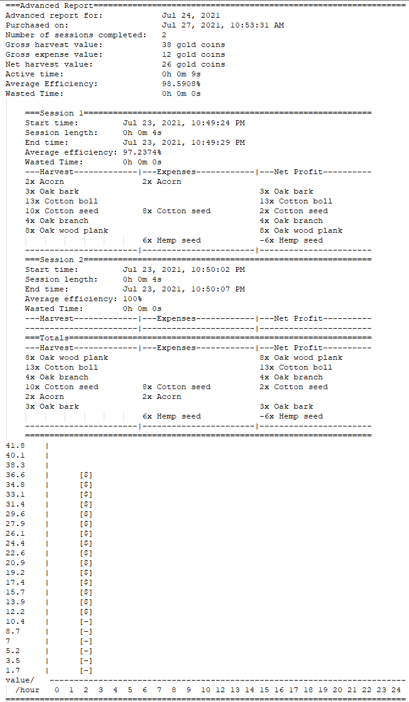

# Java Tutoring Farming Client

Join https://discord.gg/VQzdqw2FWw to play the java tutoring farming game.

Go to the farming-bot channel and **!id** to register.

**!help** for a list of commands.

Clone this repo for a Java application that interacts with the server API.

**Server IP**: 72.140.156.47

**Port number**: 45001

**Reads**: JSON

Thanks to contributors [@kertox662](https://github.com/kertox662), [@JaryJay](https://github.com/JaryJay)

Thanks to testers [@Ruin688](https://github.com/Ruin688), [@TheAvenger71](https://github.com/TheAvenger71)

Server is hosted on Donny's home laptop, stability not guaranteed.

Server is still running as of Jul 27, 2021.

# Features
Inventory:

Farmland:

Harvesting plants:

Shop to sell items:

Basic Report (10 gold coins):

Advanced Report (15 gold coins):

